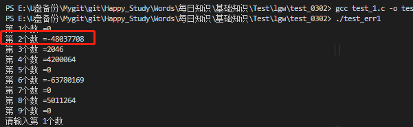
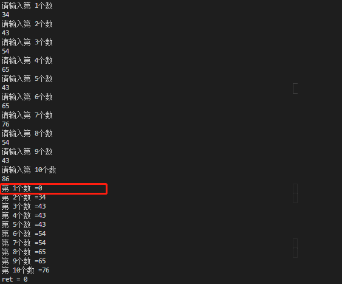

**插入排序排坑**

* 数组未初始化，导致存在异常大的数，导致结果不对

  **开始打印**



​		**处理结果**

```
使用memset初始化数组
memset（起始位置，初始化的值，数量）
  例子： memset(number,0,sizeof(int)*10);
```

* 初始化后，结果不对，第一位数是0



**原因**：因为初始化后，数组中的值都为0，比输入的值小所以排在第一位