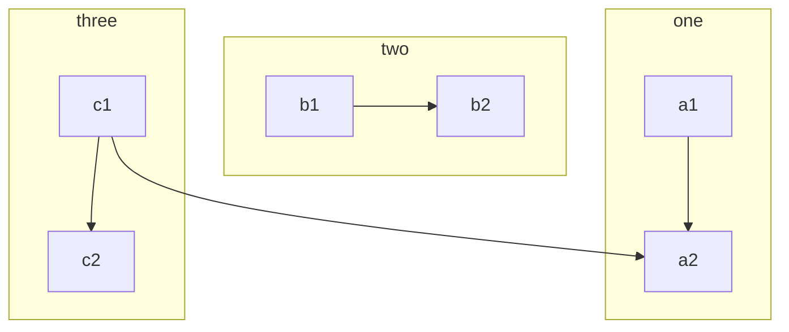
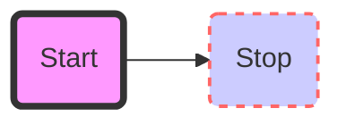

### typora 流程图

[简书流程图介绍](https://www.jianshu.com/p/af48cc77b57a)

[百度介绍](https://jingyan.baidu.com/article/48b558e3035d9a7f38c09aeb.html)

#### 大致如下

```
​``` mermaid
graph TD
开始 --> 结束

    TB - 从上到下
    BT - 从下到上
    RL - 从右到左
    LR - 从左到右
    TD - 与TB相同
xxx[正方形文本]
xxx(圆边节点)
xxx((圆形节点))
xxx>非对称的节点]
xxx{菱形的节点}
A-->B 箭头连接
A--B  直线连接
A-- 文字---B 或 A--|文字|--B  中间文字连接
A-->|文字|B 带箭头和文字
A-.->B虚线箭头连接  
A-.文字.>B 文字虚线链接
A==>B 加粗的线连接
xx[“中间填你想要的文字”]
A["这里有个引号#quot;"] -->B["特殊字符:#9829;"] 代码转义字符

```



#### 子图效果如上：

subgraph title
    graph definition
end

#### 样式链接



