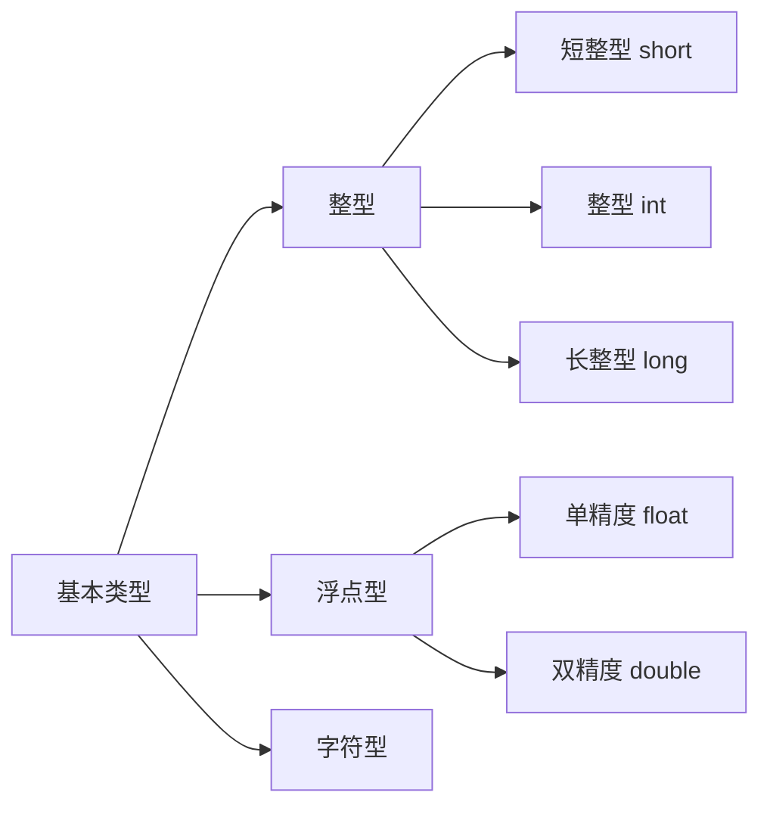

#### C语言构造类型


**C语言数据类型的种类**

* 基本类型
  * 整型
    * 短整型 short 2字节
    * 整型 int 4字节
    * 长整型 long 4字节
  * 浮点型
    * 单精度 float 4字节
    * 双精度 double 8字节
  * 字符型
    * z字符 char 1字节
* 构造类型
  * 结构体 struct
  * 枚举体 enum
  * 联合体 union
* 指针类型
* 空类型



##### 结构体

定义格式

```
typedef struct xxx
{
	类型 变量名;
    类型 变量名;
	类型 变量名;

};
定义了一个结构体xxx
样例：
typedef struct xxx
{
	char a;
    int b;
	double c;
};
注意类型可以是数组类型，和结构体
也可以这样定义
struct xxx
{
	类型 变量名;
    类型 变量名;
	类型 变量名;
	...
};
定义及声明
typedef struct xxx
{
	类型 变量名;
    类型 变量名;
	类型 变量名;
	...

}SSSS; SSSS为别名


```

**枚举体**

定义格式

```c
enum
{
	类型名 = 起始值,
    类型名1,
    类型名2,
    类型名3,
    ...
};
样例
enum
{
	orange = 1,
    apple,
    banana,
    ...
};

```


**联合体**

定义格式

```
union
{
	类型1 类型名;
    类型2 类型名2；
    类型3 类型名3；
	...
}

样例：
union
{
	char a;
	int b;
	double c;
}


```


