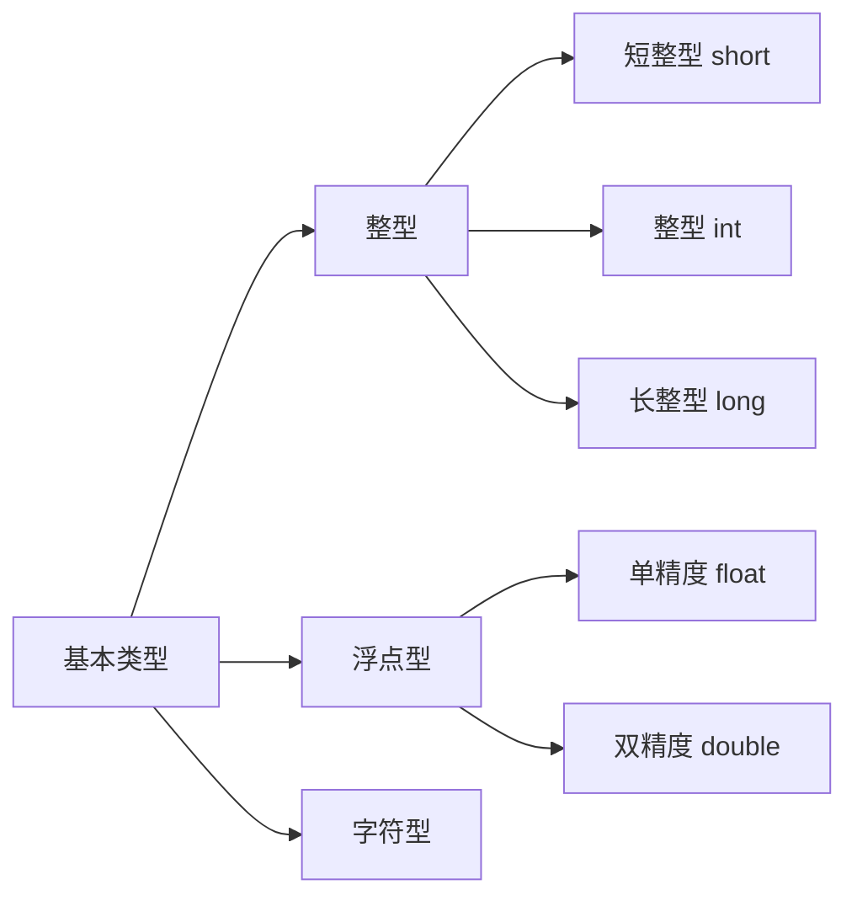

#### 计算机数据基本类型

计算机的数据类型：变量、常量

变量：

g:全局 	l:局部  	i:int型	c:char str:结构体.....

全局变量：gi_count  gstr_student

局部变量:  li_count


**C语言数据类型的种类**

* 基本类型
  * 整型
    * 短整型 short 2字节
    * 整型 int 4字节
    * 长整型 long 4字节
  * 浮点型
    * 单精度 float 4字节
    * 双精度 double 8字节
  * 字符型
    * z字符 char 1字节
* 构造类型
* 指针类型
* 空类型



**计算机 进制**

常用进制

* 十六进制0123456789 abcdef

  由0、1、2、、、、A、B、C、D、E、F十六位构成 ，0x开头

  例子：0x 123a bcdef 0000 0000

* 八进制

  有0、、、、7八位构成 ， 0或者 o开头

  例子： 0123

* 二进制

  由 0、1构成，

**打印**

```c
		在c语言中，利用‘\’和'%'进行转义
			'\n'：换行符，打印出来的效果是产生新的一行
			'\t'：横向制表符，打印出来的是横向一个TAB键
			'\v'：列向制表符，打印出来的是纵向的一个TAB键
			'\b'：退格符，打印的效果等同于backspace
			...
			1
			'%d':表示匹配一个十进制整型数，
				常用来输入/输出
			'%x':表示匹配一个十六进制的整型数，
				常用来将一个数以十六进制输入/输出
			'%c':表示匹配一个字符
			'%u':表示匹配一个无符号的十进制整型
				常用来将一个数以无符号十进制输入输出
			‘%s’：表示匹配一个字符串
			'%p':表示匹配一个地址，输入/输出的形式与%x非常类似
```
**习惯**

1、变量命名规则

* 驼峰命名  DataType
* 下划线命名 date_type

2、避免数字

int p1 ，p2 

3、前缀

4、宏定义命名

